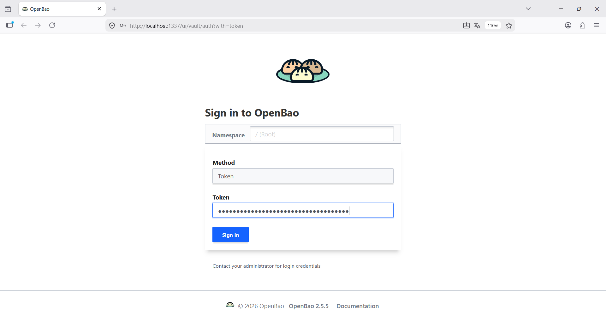
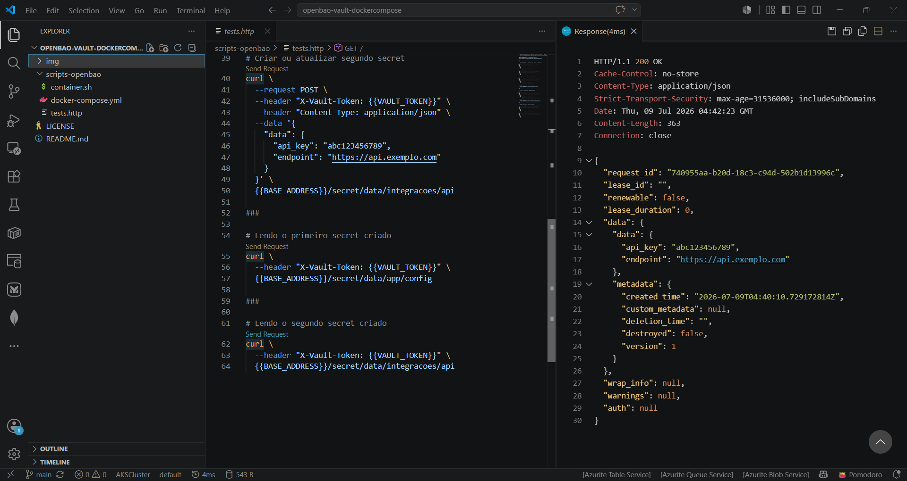
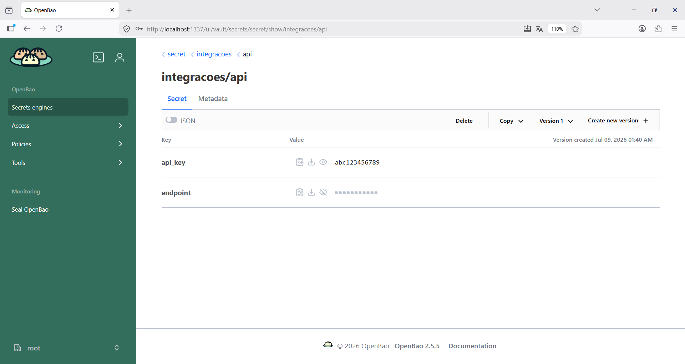

# openbao-vault-dockercompose
Scripts do Docker Compose para subida de um ambiente do OpenBao, um projeto open source para gerenciamento de secrets mantido pela Linux Foundation e que é um fork do HashiCorp Vault.

* Site oficial do projeto: **https://openbao.org/**
* GitHub: **https://github.com/openbao/openbao**
* Docker Image: **https://hub.docker.com/r/openbao/openbao**
* OpenBao UI: **https://openbao.org/docs/configuration/ui/**
* Default utilizado -> KV secrets engine - version 2 (API): **https://openbao.org/api-docs/secret/kv/kv-v2/#configure-the-kv-engine**

Interface do OpenBao: **http://localhost:1337/ui/vault/auth?with=token** | Token utilizado: **1f91d80e-0a03-49b3-b84b-f1de3d172eec**

Testes no Visual Studio Code com a extensão REST Client:

Visualizando Secrets a partir da interface do OpenBao:

